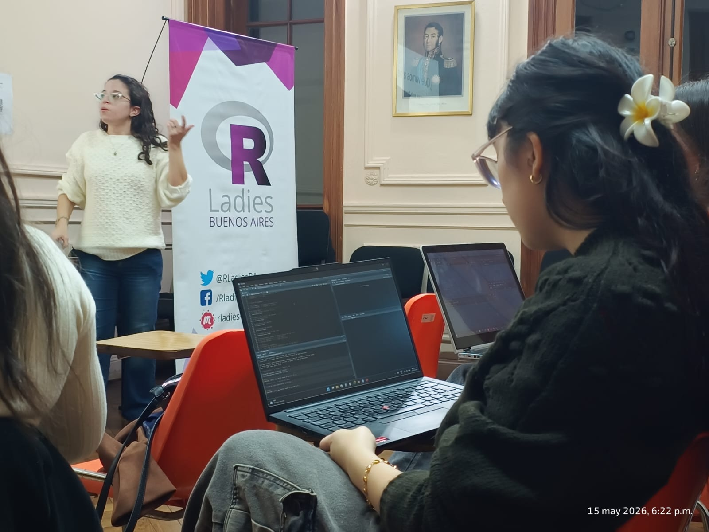
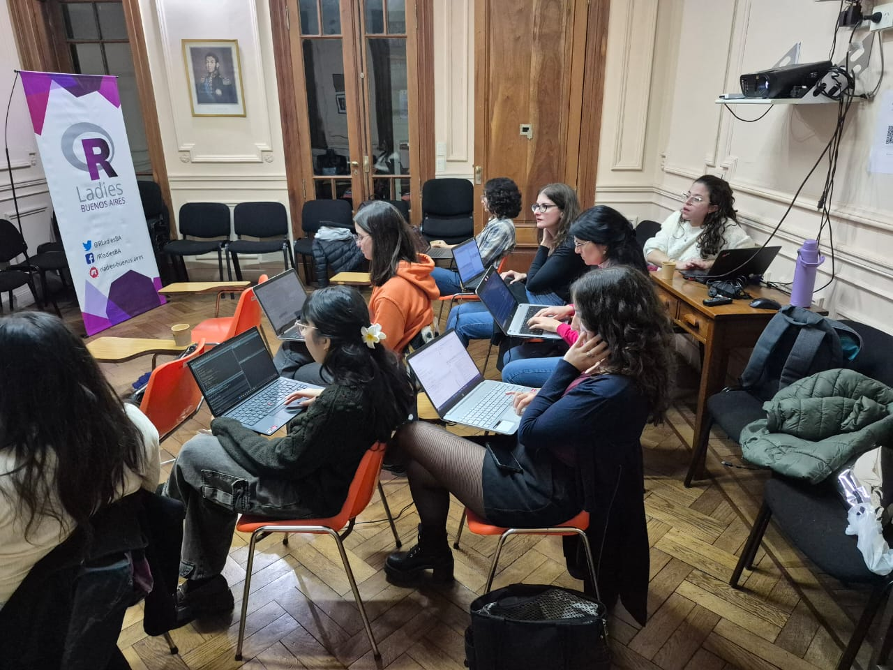

En este encuentro de R-Ladies nos acercamos a la Teoría de Respuesta al Ítem (TRI) desde una perspectiva práctica, accesible y aplicada usando R. Participaron alrededor de diez personas en una jornada de intercambio muy cálida, con preguntas, ejemplos y mucho entusiasmo por explorar herramientas de psicometría y análisis de datos.

A lo largo del taller trabajamos sobre algunos conceptos centrales de la TRI para entender cómo funcionan los ítems de un test y qué información aportan a la medición. Conversamos sobre dificultad, discriminación y consistencia de los ítems, además de explorar por qué este enfoque resulta tan útil para construir escalas más precisas y mejorar instrumentos de medición.

También hubo espacio para la práctica: usamos R para aplicar modelos introductorios e interpretar resultados, poniendo el foco en cómo leer la información que producen estos análisis y qué decisiones permiten tomar sobre un instrumento.
El taller estuvo orientado a personas con conocimientos básicos sobre escalas psicométricas y no requería experiencia previa en TRI, lo que permitió que se sumaran perfiles diversos vinculados a la psicología, la investigación social y el análisis de datos.

Queremos agradecer especialmente a todas las personas que participaron y compartieron la tarde con nosotras, haciendo del encuentro un espacio tan ameno e interesante. Y, por supuesto, un enorme gracias a Sofía Ortiz por la generosidad para compartir sus conocimientos, y a CIIPME-CONICET por recibirnos en su hermosísima casa.

 

### 🎯 Objetivos de aprendizaje

- Construir una comprensión conceptual de sus ideas principales.

- Aplicar este método usando R.

- Aprender a interpretar sus resultados para entender mejor cómo funcionan los ítems y qué aportan a la medición.

Toda la info en el repo del proyecto [aquí](https://rladies-ba.github.io/TRI-psicometria/)

